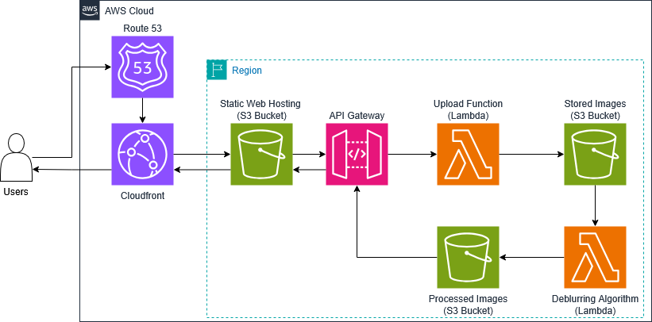

# Serverless Image Processing Application

This application leverages AWS services to provide a scalable and efficient solution for image processing. The following diagram illustrates the architecture of our serverless image processing application:

## Components and Workflow

1. **Amazon Route 53:**
   - **Purpose**: Manages DNS for the application.
   - **Function**: Resolves domain names to direct user traffic to the Amazon CloudFront distribution.

2. **Amazon CloudFront:**
   - **Purpose**: Acts as a Content Delivery Network (CDN).
   - **Function**: Caches and serves static website content, ensuring fast and secure delivery via HTTPS.

3. **Static Website Hosting (Amazon S3):**
   - **Purpose**: Hosts the static website files (HTML, CSS, JavaScript).
   - **Function**: Serves the website content to users through CloudFront.

4. **Image Upload (Client-Side):**
   - **Purpose**: Users interact with the website to upload images.
   - **Function**: JavaScript on the client-side sends a request to the API Gateway to receive a pre-signed URL.

5. **Amazon API Gateway:**
   - **Purpose**: Acts as the entry point for API requests.
   - **Function**: Triggers an AWS Lambda function to handle the request.

6. **AWS Lambda Function (Upload):**
   - **Purpose**: Generates a pre-signed URL for image uploads.
   - **Function**: Returns the pre-signed URL to the client, allowing direct upload to the 'Stored Images' S3 bucket.

7. **Image Upload (Direct to S3):**
   - **Function**: The client uploads the image directly to the 'Stored Images' S3 bucket using the pre-signed URL.

8. **S3 Event Notification:**
   - **Purpose**: Triggers actions based on S3 events.
   - **Function**: Initiates another Lambda function whenever a new image is uploaded to the 'Stored Images' bucket.

9. **AWS Lambda Function (Image Processing):**
   - **Purpose**: Processes the uploaded image (e.g., resizing, filtering).
   - **Function**: Stores the processed image in the 'Processed Images' S3 bucket.

10. **Browser Polling for Image:**
    - **Function**: The browser continuously polls the 'Processed Images' bucket to check if the image is ready.

11. **Browser Downloads Image:**
    - **Purpose**: Displays the processed image to the user.
    - **Function**: The user's browser uses a pre-signed URL to download and display the processed image from the 'Processed Images' S3 bucket.
