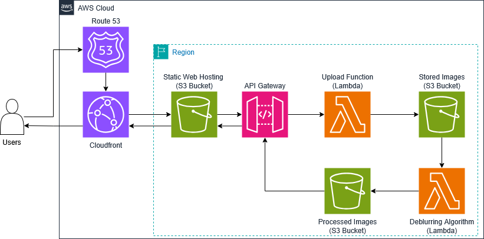

# Architecture

The following diagram illustrates the architecture of our serverless image processing application, leveraging AWS services to provide a scalable and efficient solution:

## Components and Workflow 
1. **Route 53:**  
  -**Purpose**: Manages DNS for the application.  
  -**Function**: Resolves domain names to direct user traffic to the CloudFront distribution.  
2. **CloudFront:**  
  -**Purpose**: Acts as a Content Delivery Network (CDN).  
  -**Function**: Caches and serves static website content, ensuring fast and secure delivery via HTTPS.  
3. **Static Website Hosting (S3):**  
  -**Purpose**: Hosts the static website files (HTML, CSS, JavaScript).  
  -**Function**: Serves the website content to users through CloudFront.  
4. **Image Upload:**  
  -**Purpose**: Users interact with the website to upload images.  
  -**Function**: JavaScript on the client-side sends the uploaded image to API Gateway.  
5. **API Gateway:**  
  -**Purpose**: Acts as the entry point for API requests.  
  -**Function**: Triggers a Lambda function to handle the image upload process.  
6. **Lambda Function (Upload):**  
  -**Purpose**: Processes the uploaded image.  
  -**Function**: Stores the image in the `Stored Images` S3 bucket.  
7. **S3 Event Notification:**  
  -**Purpose**: Triggers actions based on S3 events.  
  -**Function**: Initiates another Lambda function whenever a new image is uploaded to the `Stored Images` bucket.
8. **Lambda Function (Image Processing):**   
  -**Purpose**: Processes the uploaded image (e.g., resizing, filtering).  
  -**Function**: Stores the processed image in the 'Processed Images' S3 bucket.  
9. **Pre-Signed URL Generation:**  
  -**Purpose**: Provides secure access to the processed image.  
  -**Function**: The Lambda function generates a pre-signed URL for the processed image and returns it to API Gateway.  
10. **Return Pre-Signed URL:**  
  -**Purpose**: Allows the client to access the processed image.  
  -**Function**: API Gateway sends the pre-signed URL back to the client-side application.  
11. **Browser Downloads Image:**  
  -**Purpose**: Displays the processed image to the user.  
  -**Function**: The user's browser uses the pre-signed URL to download and display the processed image from the 'Processed Images' S3 bucket.  
