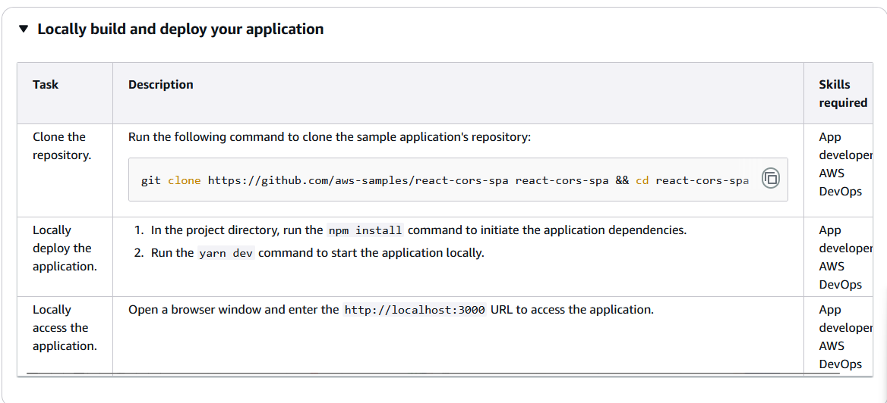
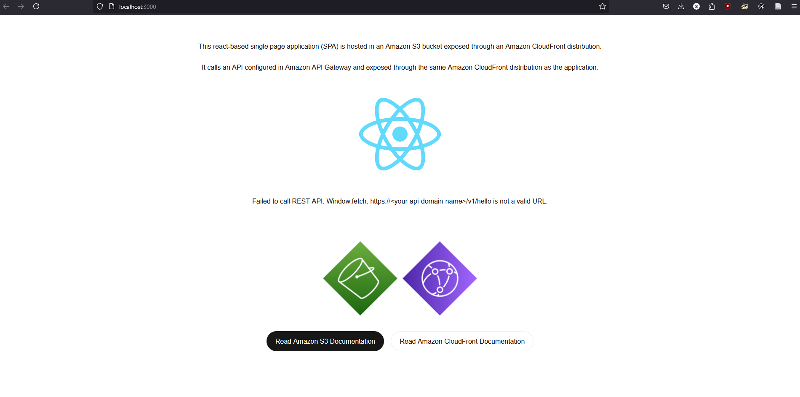
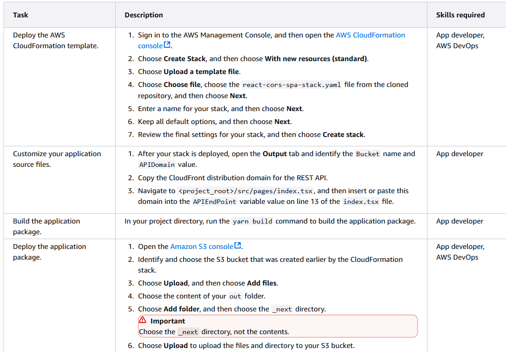
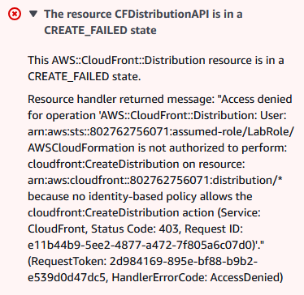
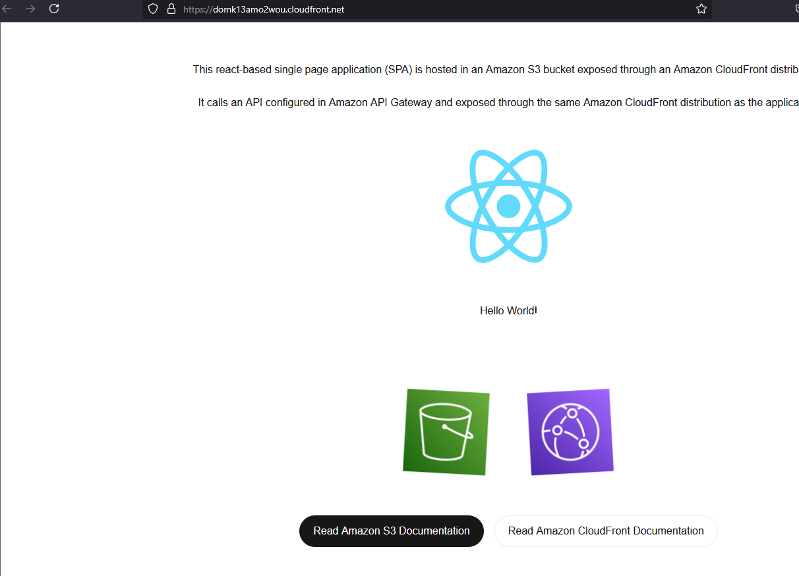

Deployment Testing:  
    Dependencies: 
        Open Source Test Repo :  https://github.com/aws-samples/react-cors-spa
        nvnm 23.9.0
        npm@10.9.2
        yarn@1.22.22'
        AWS Labs 
    Local Depployment: 
        Steps: 
            
            run "npm audit fix" too fix to fix high risk dependencies due to outdated  repo
        Result:
            
            2025-3-4 12:18AM SUCCESSFUL 
    AWS Deployment 
        Steps: 
            
        Result:
            2025-3-4- 12:31 AM FAILELD  
            
            - ran with and without IAM role "LabRole" 
            - event trace availablel in AWS_TEST_DEPLOYMENT\event_trace\event_history_test_deploy_2025-3-4-12-30-50.json
            2025-04-20 SUCCESS 
            - used personal AWS Account 
            - Demo site up and running from cloud formation stack  
            